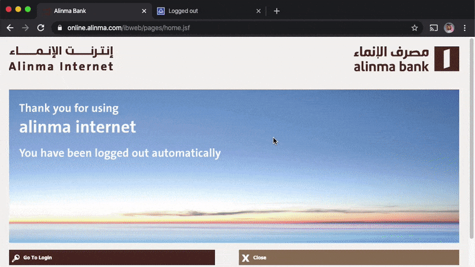

<p align="center">
    
</p>

# Bank Login Automation

An app that helps you to automate your bank account login easily (ONLY FOR macOS &amp; iOS USERS)

## Getting Started

These instructions will get this automation installed and running on your macOS platform.

### Prerequisites

#### Forward SMS messages to your macOS device

If you don't forward your SMS text messages to your macOS yet, what are you waiting for? [Do it right NOW](https://support.apple.com/en-sa/HT208386) so I can help getting the bank token and putting you in relaxation mode 💆‍♂️.

#### Disable Systems Integrity Protection (SIP)

> Since the introduction of Apple's [System Integrity Protection](https://support.apple.com/en-us/HT204899) (SIP) policy in El Capitan (10.11), various applications and features have sometimes required a circumvention of the policy in order to install correctly.

To disable SIP, Follow these [instructions](https://support.studionetworksolutions.com/hc/en-us/articles/115003839246-How-to-disable-Systems-Integrity-Protection-SIP-in-macOS) in order to access to your SMS messages chat database file.

#### Install Node Package Manager (npm)

```
brew install npm
```


#### Install Advanced Process Manager (pm2)

```
npm i -g pm2
```

#### Install Userscript Manager (tampermonkey)

Get the most popular userscript manager [Tampermonkey](https://www.tampermonkey.net/) in your browser.


### Installing

Clone the repository

```
git clone https://github.com/mtawil/bank-login-automation.git && cd bank-login-automation
```

Install packages

```
npm install
```

Run a process manager

```
pm2 start app.js
```

Install bank userscripts:
* [Alinmabank](https://github.com/mtawil/bank-login-automation/raw/master/userscripts/alinma.user.js)
* [Alrajhibank](https://github.com/mtawil/bank-login-automation/raw/master/userscripts/alrajhi.user.js)


## Built With

* [Nodejs](https://nodejs.org/) - JavaScript runtime
* [Expressjs](https://expressjs.com/) - Web framework for Node.js
* [better-sqlite3](https://github.com/JoshuaWise/better-sqlite3) - Used to connect to Sqlite DB files

## Contributing

Please read [CONTRIBUTING.md](CONTRIBUTING.md) for details on our code of conduct, and the process for submitting pull requests to us.

## Versioning

We use [SemVer](http://semver.org/) for versioning. For the versions available, see the [tags on this repository](https://github.com/mtawil/bank-login-automation/tags). 

## Authors

* **Mohammad ALTAWEEL** - *Initial work* - [mtawil](https://github.com/mtawil)

See also the list of [contributors](https://github.com/mtawil/bank-login-automation/contributors) who participated in this project.

## License

This project is licensed under the MIT License - see the [LICENSE.md](LICENSE.md) file for details
